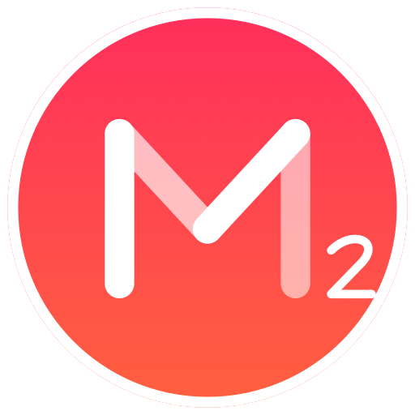
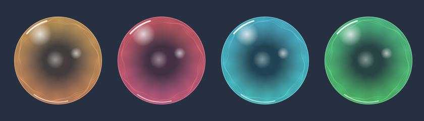

<p align="center">
  
</p>

# Minutes2

使用 **Swift + AppKit** 开发的原生 macOS 番茄钟。以简洁的圆形时钟、毛玻璃背景和渐变色呈现专注时间，结束后以透明彩色泡泡、音乐和休息倒计时提醒休息。

支持 **macOS 13 及以上**，构建产物同时支持 **Apple Silicon 和 Intel Mac**，无需第三方依赖。

## 功能

- **圆形计时器**：拖动圆周上的时间圆点设置 1–60 分钟，上方显示预计结束时间。
- **矢量数字**：分钟与秒数均使用圆润的矢量字形，进入最后一分钟自动显示秒数。
- **渐变背景**：剩余时间从蓝、绿、黄、橙逐渐过渡到红，操作时带平滑切换动画。
- **毛玻璃效果**：设时、暂停和选择到时音乐时显示桌面模糊背景。
- **多计时器**：各窗口独立计时、暂停、重复和选择音乐；同时到时的提醒依次呈现。
- **桌面控制**：支持长按拖动、窗口置顶、尺寸、透明度及倍速设置。
- **到时音乐**：内置六首音乐，支持自动试听、静音和自选音频。
- **泡泡休息提醒**：半透明泡泡叠加在当前桌面上，持续增多，屏幕中央显示休息倒计时。
- **破裂效果**：双击后泡泡膨胀破开、碎片散开并淡出，同时播放轻柔的水泡破裂音效；音效播放完后停止提醒音乐。
- **重复计时**：休息自然结束后自动开始下一轮专注。
- **动态 Dock 图标**：运行时图标背景和白色进度弧随番茄钟变化。

## 安装与运行

从源码构建后，双击 `build/Minutes2.app`，也可将它拖入“应用程序”文件夹。

仓库包含源代码与资源，`build/` 下的应用及压缩包不纳入版本控制。当前构建脚本采用本机 ad-hoc 签名，不包含 Apple Developer 正式签名或公证。

## 使用方法

### 设置、开始与暂停

1. 拖动圆周上的彩色圆点，设置专注时间。
2. 第一次单击圆盘选中番茄钟并显示背景阴影。
3. 在选中状态再次单击，开始、暂停或继续计时；也可按空格或 Enter。
4. 点击其他地方取消选中，不改变计时状态。

暂停后可拖动时间圆点调整剩余分钟，或使用滚轮、方向键微调。按住圆盘约 0.35 秒后拖动，可移动番茄钟并保存窗口位置。

剩余时间超过一分钟时显示分钟数，进入最后一分钟后显示 `60、59、58…1` 秒。白色进度弧以 60 分钟为满圆。

| 剩余时间 | 背景颜色 |
| --- | --- |
| 60 分钟 | 蓝色 |
| 45 分钟 | 绿色 |
| 30 分钟 | 黄色 |
| 15 分钟 | 橙色 |
| 0 分钟 | 红色 |

相邻颜色之间随剩余时间平滑过渡。

### 选择音乐

点击圆盘下方的音乐图标，或使用“计时器 → 到时音乐…”，在圆盘内打开毛玻璃音乐选择器。

内置音乐为 **禅音、溪流、安静、空灵、秋天、轻快**，默认使用“禅音”。还可选择静音，或从文件夹中选择 MP3、M4A、WAV、AIFF 音频。

- 鼠标移到音乐图标上自动试听；移到静音图标停止试听。
- 左右方向键或两侧图标切换音乐。
- Enter 或点击中央图标确认选择。
- Esc 或点击圆盘外取消选择。

### 休息与泡泡提醒

在“计时器 → 休息时间”中选择 **5、10、15、30 分钟**，默认 5 分钟。设置作用于之后开始的休息。

专注结束后，番茄钟窗口隐藏，提醒音乐循环播放。每个屏幕中央显示白色矢量休息倒计时；泡泡以粉、蓝、黄绿、青、紫、橙等不同颜色为主，保留通透球面和白色高光。



移动鼠标、单击或按键不会结束提醒。**双击结束休息**，触发泡泡破裂动画和水泡音效；提醒音乐在音效播放完后停止，随后返回设时状态。

开启“重复计时”时，休息倒计时自然结束后自动开始下一轮完整番茄钟。双击提前结束休息则返回设时状态。

### 菜单

| 菜单 | 功能 |
| --- | --- |
| Minutes2 | 关于、隐藏及退出应用 |
| 计时器 | 新建、关闭、开始或暂停、重复计时、休息时间、预设时长、重置及到时音乐 |
| 视图 | 保持在前台、预览彩球提醒、大小、透明度及倍速模式 |
| 窗口 | 居中显示、窗口置顶及前置全部窗口 |
| 帮助 | 使用说明 |

“视图 → 大小”支持 **150%、120%、100%、80%、50%**；“视图 → 透明度”支持 **100%、75%、50%、25%、0%**。这两项作用于当前番茄钟，并保存为下次启动或新建窗口的默认值。

“视图 → 倍速模式”支持 **正常速度（1 倍）、2、4、8、16 倍速**，用于当前番茄钟的专注倒计时。运行中切换速度保留当前剩余时间，预计结束时间、颜色和进度同步更新；暂停、继续和重复计时沿用所选速度。设置会保存为下次启动或新建窗口的默认值，休息倒计时仍按正常速度运行。

透明度为 0% 时窗口完全透明，不阻挡桌面点击，计时仍继续。通过顶部“视图 → 透明度”恢复显示；必要时先使用菜单栏计时器中的“显示番茄钟”激活应用。

右键圆盘可打开计时菜单并退出 Minutes2。休息时间设置只出现在顶部“计时器”菜单中。

### 快捷键

| 操作 | 快捷键 |
| --- | --- |
| 新建番茄钟 | ⌘N |
| 关闭当前番茄钟 | ⌘W |
| 开始、暂停或继续 | 空格 / Enter |
| 重置计时 | ⌘R / Esc |
| 设置 1、3、5 分钟 | ⌘1 / ⌘3 / ⌘5 |
| 设置 10、20、30、50、60 分钟 | ⌥⌘1 / ⌥⌘2 / ⌥⌘3 / ⌥⌘5 / ⌥⌘6 |
| 隐藏应用 | ⌘H |
| 退出应用 | ⌘Q |

预设时间只在设时或暂停状态可用。音乐选择器打开时，左右键、Enter 和 Esc 用于选择音乐。

## 开发与构建

需要 Xcode 或带匹配 macOS SDK 的 Swift 开发环境；运行 XCTest 测试需要完整的 Xcode 工具链。

```sh
git clone git@github.com:FindTreasureIsland/MInutes2.git Minutes2
cd Minutes2

bash scripts/build.sh
open build/Minutes2.app
```

构建脚本生成 ARM64 + x86_64 的 Universal 应用，打包图标、音乐和水泡音效，并进行 ad-hoc 签名验证。脚本可使用独立安装的 Command Line Tools 作为构建工具链。

也可用 Xcode 打开 `Minutes2.xcodeproj`，选择 **Minutes2** scheme 运行。通过 `Package.swift` 运行时，不会自动打包应用资源；完整体验请使用 `.app` 构建。

运行核心逻辑测试：

```sh
bash scripts/test.sh
```

测试覆盖计时截止、暂停恢复、重复计时、休息倒计时、提醒队列、圆周设时和颜色插值。

### 项目结构

```text
Sources/
  Minutes2/          AppKit 界面、矢量图形、音乐和提醒
  MinutesCore/       计时状态、设时换算、颜色和提醒队列
Tests/               核心逻辑测试
Resources/           图标、矢量 Logo、音效和应用配置
music/               内置到时音乐
docs/images/         README 图片
scripts/             构建、测试、图标及音效生成工具
Minutes2.xcodeproj/   Xcode 工程
Package.swift        Swift Package 配置
```

`scripts/make-bubble-pop.py` 生成水泡音效；`scripts/make-icon.swift` 与 `Sources/Minutes2/MinutesLogo.swift` 共用矢量 Logo 绘制代码。可编辑的 Logo 位于 `Resources/Minutes2Logo.svg`。

计时基于真实截止时间，系统唤醒后会检查是否到时；运行及休息期间申请防止空闲自动休眠。应用退出后不恢复之前的计时会话。

原版应用目录 `Minutes_x86/`、构建产物 `build/`、缓存 `.build/` 和个人 Xcode 配置均由 `.gitignore` 排除。

## 致敬与感谢

- **致敬**：HANDS MEMORY
- **感谢**：Yosuke Ito、Yuri Miyauchi、K Sasaki、Kenzo Yamaguchi
- **开发人员**：Whiplasher
